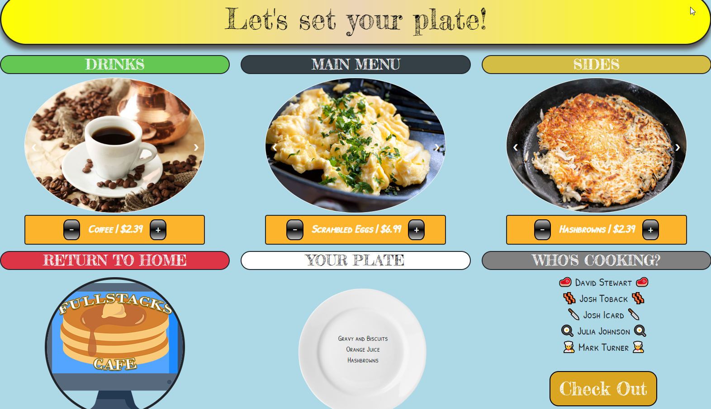

# FullStacks Cafe Menu and Ordering Application

Link to deployed app on Heroku:

Screenshot of application:

## Description
This full stack application serves as an ordering system for a cafe. This MVP iteration works as an ordering app on in-house kiosks at each table, customers can select their order and send it  to the kitchen where each order can veviewd on a command line interface system. This application is scalable to become a full service online ordering website and menu page, as well as being tied in to an automated ticket printer.

## Table of Contents
* [Installation](#installation)
* [Usage](#usage)
* [License](#license)
* [Contribution](#contribution)
* [Testing](#testing)
* [Questions](#questions)

## Installation
For this demonstration the application is deployed to Heroku. For full deployment in a restaurant environment, a server would be setup and connected to the ordering kiosks, as well as a terminal available to the manager or potentially tied in to the existing POS system.

## Usage
When run, the front-end acts as a menu and ordering system, customers can select their chosen dishes and beverages and checkout, which sends the order to the server. A command line interrface which is run frwith node.js from the command line byr running manager.js opens the CLI , which is passowrd protected, and allows viewing the orders.

## License
This project is licensed under the <a href="https://opensource.org/licenses/MIT">MIT</a> license.

## Contribution
Contributors: Julia Johnson, Josh Icard,  Joshua Toback, David Stewart, and Mark Turner.

## Testing
The ordering routes can be tested from insomnia to verify their functionality to communicate with the database.

## Questions
For questions about this repo, application, or to provide feedback please contact me at 

My GitHub repo can be found at [GitHub](https://github.com/)
